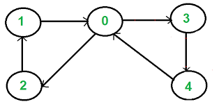
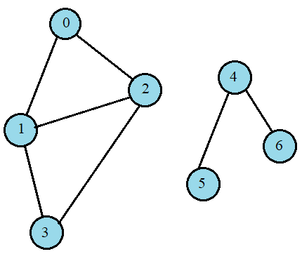
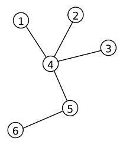
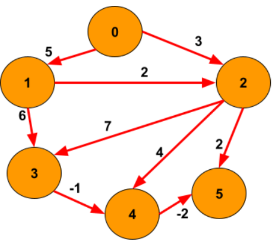
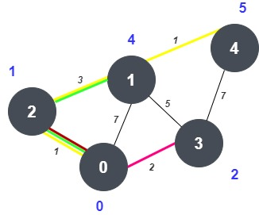
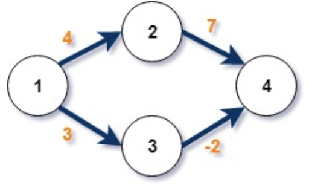
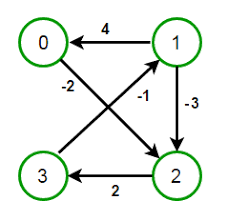

# **Graph Thoery**

## Code Example

- **[Graph Thoery](Graph_Theory.cpp)**

<figure>
    
    <figcaption >Undirected Graph-1</figcaption>
</figure>

### Basics of Graph Algorithms

**[1. BFS](1_BFS.cpp)**

**[2. DFS](2_DFS.cpp)**

### Check Cycle

**[3. Check cycle in Undirected Graph (BFS)](3_CheckCycle(BFS).cpp)**

**[4. Check cycle in Undirected Graph (DFS)](4_CheckCycle(DFS).cpp)**

<figure>
    
    <figcaption>Directed Graph-1</figcaption>
</figure>

**[5. Check cycle in Directed Graph (DFS)](5_CheckCycleDirected(DFS).cpp)**

**[6. Check cycle in Directed Graph (BFS && Kahn's Algorithm)](6_CheckCycle(BFS%20and%20Kahns).cpp)**

<figure>
    
    <figcaption>Disconnected Graph</figcaption>
</figure>

<figure>
    
    <figcaption>Undirected Graph-2</figcaption>
</figure>

### Topological Sorting

<figure>
    
    <figcaption>Directed Acyclic Graph</figcaption>
</figure>

**[7. Topological Sort (using DFS) ](7_TopoSort(DFS).cpp)**

**[8. Topological Sort (Kahn's Algorithm)](8_TopoSort(Kahns%20Algo).cpp)**

### Shortest Path in Graph

14. Shortest path in undirected graph (BFS)
15. Shortest path distance in undirected graph

<figure>
    
    <figcaption>Weighted Directed Acyclic Graph</figcaption>
</figure>

16. Shortest distance form source to all node (weighted DAG)
    

<figure>
    
    <figcaption>Weighted Graph-1</figcaption>
 </figure>   
    
17. Shortest distance form source to all node (weighted) (Dijkstra Algorithm)

<figure>
    
    <figcaption>Weighted Graph-2 (Negative Edge)</figcaption>
</figure>

<figure>
    
    <figcaption>Weighted Graph-3 (Negative Cycle)</figcaption>
</figure>

18. Shortest path in weighted graph with negative edge (Bellmon Ford Algorithm)

19. Floyd-Warshal Shortest Path

### Minimum Spanning Tree

<figure>
    
    <figcaption>weightedGraph 4 (For MST)</figcaption>  
</figure>

20. Minimum Spanning Tree (Prim's Algorithm)
21. Minimum Spanning Tree (Kruskal Algorithm) (disjoint set)

### Bridge

<figure>

<figcaption>Bridge Graph</figcaption>
</figure>

22. Finding Bridge
23. Finding Articulation Point

### Strongly Connected Components

<figure>

<figcaption>Graph of Strongly Connected Components</figcaption>
</figure>

24. Number of Strongly Connected Components (Kosaraju Algorithm)
25. Strongly Connected Components List (Kosaraju Algorithm)

### Graph Coloring Problem

### Maximum Flow Problem
